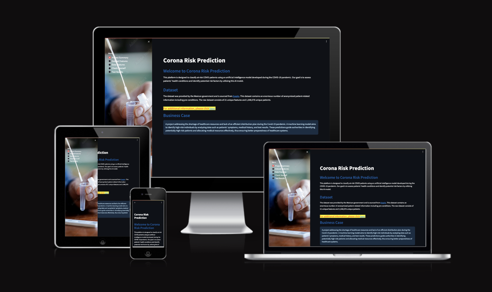

# Covid Risks Prediction

Coronavirus disease (COVID-19) is an infectious disease caused by a recently discovered coronavirus that has affected people worldwide. Most individuals infected with the coronavirus, including young and healthy individuals, experience mild to moderate respiratory symptoms and recover without requiring special treatment. However, elderly individuals and those with underlying medical conditions such as cardiovascular diseases, diabetes, chronic respiratory diseases, and cancer are at a higher risk of developing severe complications. For these individuals, these complications could even lead to fatalities.

One of the main challenges faced by healthcare providers during the pandemic is the shortage of medical resources and the lack of an effective plan for their distribution. Being able to predict in advance what type of resources an individual may need during challenging times and directing resources accordingly is the primary goal of our project.

[Covid Risk Prediction Live Application](https://covid-predictors-0ff909d85a90.herokuapp.com/)

