# Covid Risks Prediction

Coronavirus disease (COVID-19) is an infectious disease caused by a recently discovered coronavirus that has affected people worldwide. Most individuals infected with the coronavirus, including young and healthy individuals, experience mild to moderate respiratory symptoms and recover without requiring special treatment. However, elderly individuals and those with underlying medical conditions such as cardiovascular diseases, diabetes, chronic respiratory diseases, and cancer are at a higher risk of developing severe complications. For these individuals, these complications could even lead to fatalities.

One of the main challenges faced by healthcare providers during the pandemic is the shortage of medical resources and the lack of an effective plan for their distribution. Being able to predict in advance what type of resources an individual may need during challenging times and directing resources accordingly is the primary goal of our project.


[Covid Risk Prediction Live Application](https://covid-predictors-0ff909d85a90.herokuapp.com/)

[Covid Risk Project User Stories](https://github.com/users/mdurmus/projects/7/views/1)

[Covid Risk Prediction Issues](https://github.com/mdurmus/Covid-Risks-Prediction/issues)

## Table of Contents

[Dataset Content](#dataset-content)

[Business Requirements](#business-requirements)

[Hypothesis and Validation](#hypothesis-and-validation)

[ML Based Disease Concerns Addressing Application](#ml-based-disease-concerns-addressing-application)

[ML Business Case](#ml-business-case)

[Implementation of CRISP-DM](#implementation-of-crisp-dm)

[Dashboard Design](#dashboard-design)

[Feature Developments](#feature-developments)

[Testing](#testing)

[Data Analysis and Machine Learning Libraries](#data-analysis-and-machine-learning-libraries)

[Deployment](#deployment)

[Credits](#credits)

[Acknowledgements](#acknowledgements)

## Dataset Content

The source of this dataset is the [Kaggle](https://www.kaggle.com/datasets/meirnizri/covid19-dataset) website. The dataset has been provided by the Mexican government. Originally, it consists of 21 features and a total of 1,048,576 patient records. However, due to feature engineering efforts, the number of features has been reduced to 16. You can find relevant explanations on the project page.

| Variable | Meaning  | Units    |
|----------|----------|----------|
| USMER  | The variable that indicates whether the patient has received COVID treatment before. | Yes, No  |
| SEX  | The variable that stores the gender of the patient.  | Male, Female  |
| PATIENT_TYPE  | The variable that stores whether the patient's treatment should be done at home or in the hospital.  | Returned Home, Hospitalization  |
| PNEUMONIA | The variable that stores the presence of pneumonia in the patient. | Yes, No |
| AGE | The variable that stores the age information of the patient. | Numeric |
| DIABETES | The variable that stores whether the patient has diabetes or not. | Yes, No |
| COPD | The variable that stores whether the patient has COPD (Chronic Obstructive Pulmonary Disease) or not. | Yes, No |
| HIPERTENSION | The variable that stores whether the patient has hypertension or not. | Yes, No |
| OTHER_DISEASE | The variable that stores whether the patient has any other condition or not. | Yes, No |
| CARDIOVASCULAR | The variable that stores whether the patient has cardiovascular disease or not. | Yes, No |
| OBESITY | The variable that stores whether the patient is obese or not. | Yes, No |
| RENAL_CHRONIC | The variable that stores whether the patient has a chronic kidney condition or not. | Yes, No |
| MEDICAL_UNIT | The type of National Health institution providing patient care and treatment. | 1-13 |
| CLASIFFICATION_FINAL | Covid test results. | 1-7 |

[Back to Top](#table-of-contents)

## Business Requirements

The AI-based Covid risks prediction project will collect and integrate Covid-19 test results and symptom data from healthcare institutions and other sources. These data will be analyzed by a risk scoring algorithm and presented to users via a user interface. The project will encompass ensuring the security and privacy of user data, compliance with GDPR and similar legal regulations, scalability and performance, authentication and authorization processes, transmission and monitoring of results, and regular system maintenance.

This AI-driven Covid risks prediction software will serve as a fast and effective Covid-19 monitoring and control tool for governments and healthcare institutions. It will provide significant support in identifying and guiding high-risk individuals to healthcare systems. Additionally, it will help create a secure environment for businesses and communities, thus aiding in preventing the spread of the pandemic. Individuals will be informed about their health status, enabling them to track and protect themselves, making them more aware and effective in combating the pandemic.

### Hypothesis and Validation

#### Hypothesis

The hypothesis of the AI-based Covid risk prediction project is that it can accurately and reliably predict individuals' Covid-19 risk using Covid-19 test results and symptom data, thereby assisting healthcare institutions in effectively identifying high-risk individuals and guiding treatment.

#### Validation

The validation method involves evaluating the performance of the software on real-world data, particularly assessing its ability to accurately identify high-risk individuals. Furthermore, its effectiveness in guiding healthcare institutions and receiving feedback from them will be assessed to iterate and improve the software.

[Back to Top](#table-of-contents)

## ML Based Disease Concerns Addressing Application

### Model Evaluation and Feature Selection

I used the scikit-learn library for optimizing model parameters. There is a need for an application that works with a machine learning-based classification system to address the concerns of each individual in the public regarding the disease.

I used the correlation test to understand the relationships between variables in my dataset and to identify which variables are correlated. Additionally, the results of this test helped me understand the relationships between variables. Understanding the relationships between variables also facilitated my feature selection process.

- Training Accuracy Score: 0.9626941603535738
- Testing Accuracy Score: 0.9328095221847994
- F1 Score: 0.48611369990680336
- Confusion Matrix: Overall, the predicted values are close to the true values. The highest accuracy rate is 90.10%, and the lowest accuracy rate is 3.18%.
- Decision Tree ROC Curve: The slope is quite high, indicating that the model performs well. The curve starts from the bottom left corner and extends to the top right corner. This indicates that the model achieves high accuracy at all threshold values.

You can access the details of these tests from the Test Results page within the project.

[Back to Top](#table-of-contents)

## ML Business Case

### Business Requirements

1. The customer wants to see how data related to COVID-19, such as disease symptoms and test results, can be gathered and analyzed. 

2. The customer also wants to develop a model capable of predicting COVID-19 cases.

### Business Goal Addressable with Traditional Data Analysis

We can explore the relationships between specific symptoms associated with COVID-19 and test results.

### Dashboard or API Endpoint Need

The customer wants to track COVID-19 cases through a dashboard interface.

### Successful Project Outcome

Delivering a study on significant determinants related to COVID-19. Additionally, developing a model capable of predicting COVID-19 cases.

### Project Epics and User Stories

- Information gathering and data collection: Gathering data associated with COVID-19 cases.

- Data visualization, cleaning, and preparation: Visualizing data, cleaning it, and preparing it for modeling.

- Model training, optimization, and validation: Developing and optimizing a model to predict COVID-19 cases.

- Dashboard planning, design, and development: Creating a dashboard that visualizes COVID-19 cases.

- Dashboard deployment and release: Making the dashboard ready for use and delivering it to the customer.

### Recommended Model
The data suggests proposing a classification model that can predict COVID-19 cases.

### Model Inputs and Outputs
The inputs are data associated with COVID-19, such as disease symptoms and demographic information. The output includes predicting the likelihood or probability of an individual contracting COVID-19.

### Performance Targets for Predictions
Performance metrics such as accuracy and precision of the model will be used to assess its ability to predict COVID-19 cases.

### Customer Benefits
A model that predicts COVID-19 cases can assist healthcare institutions in disease control and resource management. Additionally, it can serve as an informative tool for the overall health of the community.

[Back to Top](#table-of-contents)

## Implementation of CRISP-DM

In my project, I've adopted the Cross Industry Standard Process for Data Mining (CRISP-DM) framework as a systematic method to steer the creation and implementation of the machine learning solution. CRISP-DM comprises six primary stages: Business Understanding, Data Understanding, Data Preparation, Modeling, Evaluation, and Deployment. Let's delve into how each stage was integrated into this initiative:

- **Business Understanding:** When starting my project, I began by establishing the goals and requirements of the project. At this stage, the most crucial aspect was understanding what the end user expected to see on the screen. And, of course, it was essential to calculate where I needed to start. This allowed me to plan and clarify each stage of the project from its foundation to its endpoint.

- **Data Understanding:** The most crucial point of a project was understanding and structuring the dataset correctly. Therefore, it was imperative for me to have a thorough understanding of the dataset I would be using. In examining the dataset, I first needed to determine what the features should be and how these features should be organized, as well as identify which variables would be useful or necessary for the target labels. To do this, I had to comprehend the dataset I examined on Kaggle and then create a list of actions to take on the dataset.

- **Data Preparation:** During the data preparation stage, it was crucial to ensure that my dataset was suitable for model training. This involved cleaning the data to address missing or inconsistent values, performing feature engineering to extract relevant information from the data, and preparing the dataset for modeling. Additionally, I aimed to build a stronger model by increasing the diversity of the data in the dataset to train the model effectively.

- **Modeling:** While conducting the modeling process, I utilized the scikit-learn extension to both construct the model and train it. Additionally, I defined the architecture and performed hyperparameter tuning to optimize performance.

- **Evaluation:** During this stage, I conducted various tests to evaluate the performance of the model and ensure the correctness of my actions. Splitting the dataset into training and testing sets allowed me to develop new behaviors based on the results of performance metrics from these tests. I iteratively refined models based on evaluation results to enhance their accuracies and classification capabilities.

- **Deployment:** In the final stage of CRISP-DM, I programmed the outcomes of the aforementioned five stages to be available to stakeholders or customers through an interface or API system. In my project, I programmed a web interface using the Streamlit extension and made it available for users. Continuous monitoring and maintenance ensure the continuity of the project by reviewing possible or reported errors.

By adhering to the CRISP-DM framework, I guaranteed a methodical and organized method throughout the entirety of the data mining journey, starting from grasping the business dilemma to implementing the remedy in an actual setting.


[Back to Top](#table-of-contents)

## Dashboard Design

1. Project Summary

    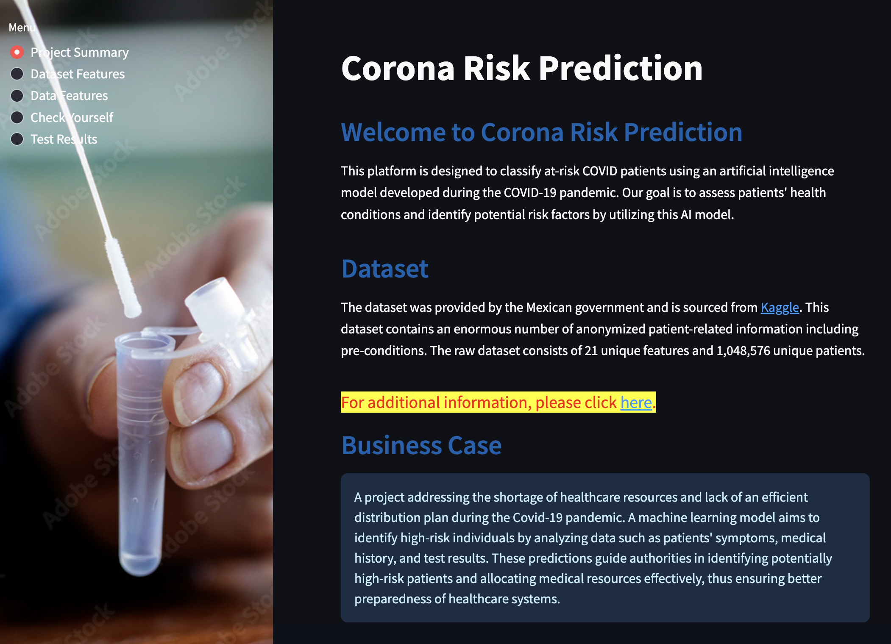

    - In this screen, I am explaining what the application can be used for and what its goal is.

    - General information about the dataset obtained from Kaggle is provided, including the total number of records and details about the variables.

    - The last paragraph on the relevant page explains why the project was developed, in other words, I am outlining our customers' requests and expectations from us.

2. Dataset Features

    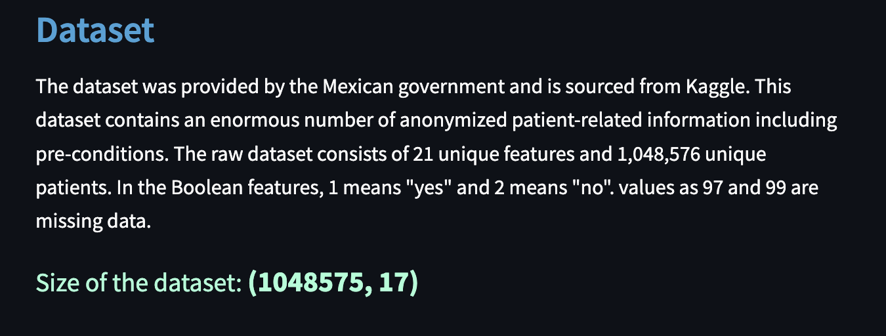

    - **Dataset**: In this section, the number of records and variables in the dataset has been specified. After selecting features, I organized some boolean variables according to our business logic and made changes to their values. I also displayed the total number of records in this area.

    - **Data Cleaning** 

        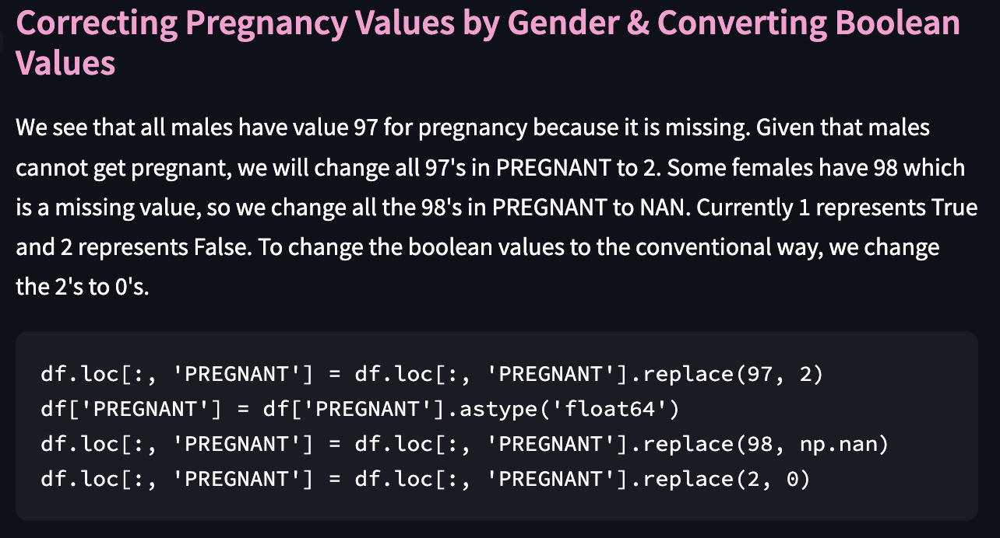
    
        - Correcting Pregnancy Values by Gender: In this section, I initially adjusted variables assessing the pregnancy status for females. In the original dataset, some females had values of 98, and some had 97 for this variable, while in some cases, it was observed to be NaN. Logically, a female can either be pregnant or not pregnant; hence, I converted this variable to a boolean type. Since males cannot be pregnant, I decided that it was illogical to use this variable for them and removed it from my dataset.

       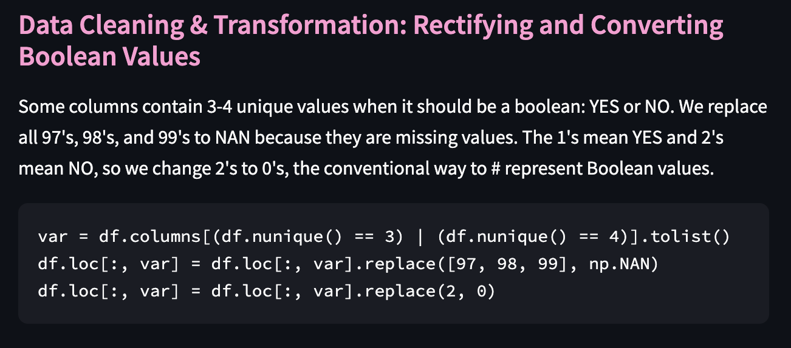

        - Data Cleaning & Transformation: Some columns had taken values like 97, 98, or 99 instead of boolean values, which was fundamentally illogical. Instead, areas equal to 1 were set to TRUE, and areas equal to 2 were set to FALSE to represent them.
        
       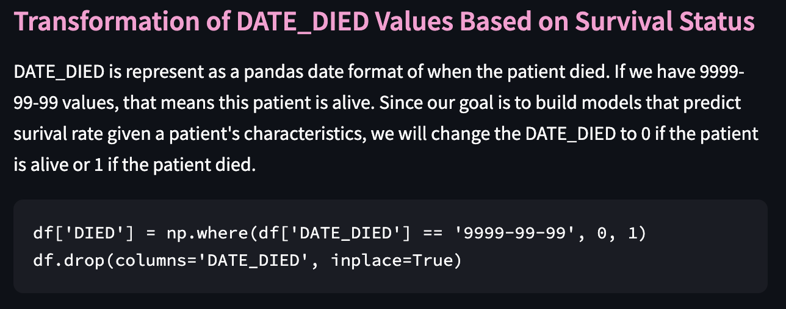

        - Transformation of DATE_DIED Values: The column DATE_DIED represents when the patient died in pandas format. If the value is 9999-99-99, it means the patient is alive. However, in my opinion, this could be represented with a boolean field. So, if the patient is alive, it would take FALSE, and if not, it would take TRUE.

       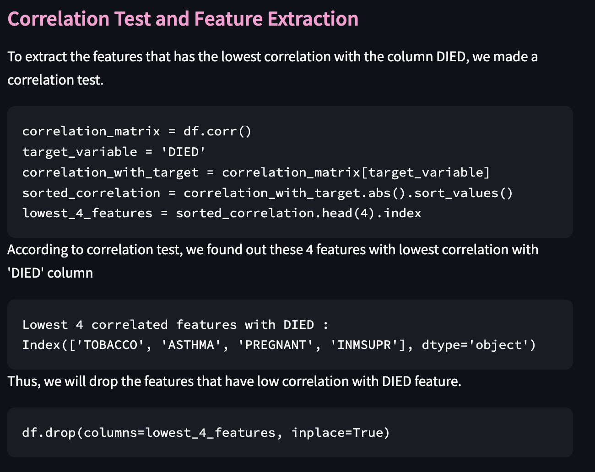

        - Correlation Test and Feature Extraction: In our application, the primary goal is to determine whether an individual is alive or deceased. Therefore, the most important column for us is 'DIED'. I attempted to assess the relationship between my target variable and other variables by calculating correlation matrices on the dataset. This was done as a correlation test. As a result, I was quite surprised to see that the following four variables had little to no impact on the outcome:

        ```
        ['TOBACCO', 'ASTHMA', 'PREGNANT', 'INMSUPR']
        ```

        - Data Accuracy and Missing Values Analysis: To report one of the most critical aspects of a dataset, I calculated the completeness rates of the values for 16 features in the dataset.

3. Data Features

    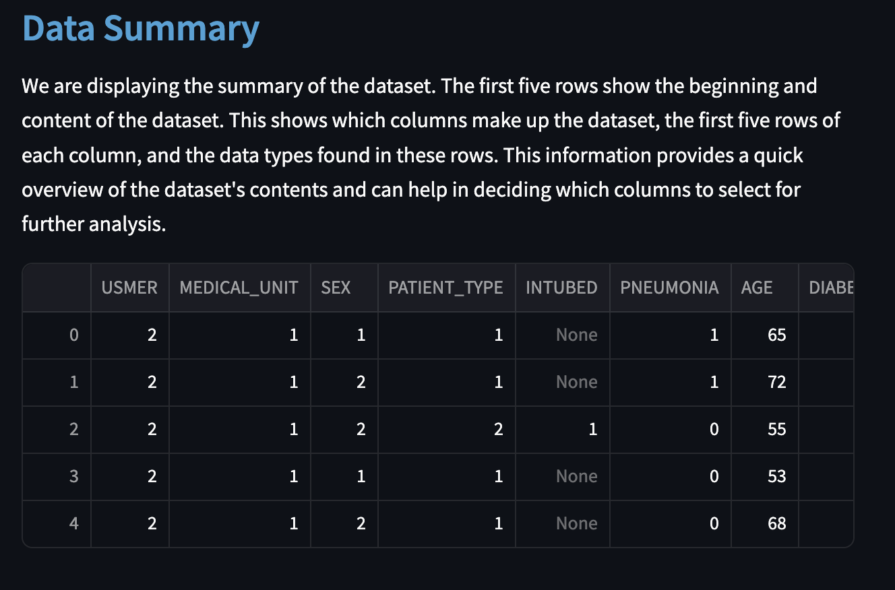

    - **Data Summary** We are viewing a summary of the dataset here. The first five records of all columns in the dataset are displayed, providing us with a brief overview of the data. The number of records displayed here can be updated as desired. However, due to technical constraints, increasing this number may lead to system strain or even render it unusable. Therefore, the number of records is limited to five here.

    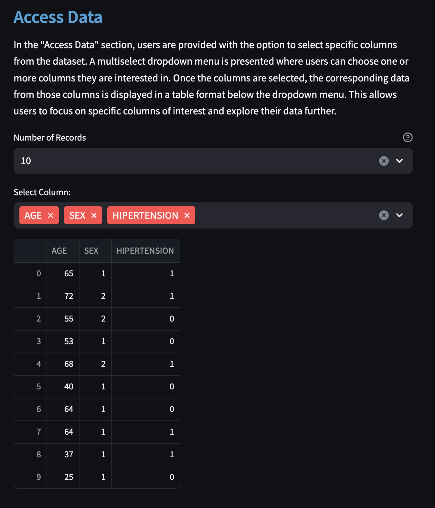

    - **Access Data** In this section, users have the opportunity to select the columns they desire from the dataset. However, given the dataset's size, it's crucial for users to also determine the number of records displayed here. Without such control, issues like connection disruptions or data inconsistencies may arise, underscoring the necessity of limiting user selection. To accomplish this, users should be guided on how to specify both the columns and the number of records they wish to view. This empowers them with flexibility while ensuring system stability.

        Now, why is it important to limit the user's selection? By imposing constraints, such as a maximum number of records, we ensure that the system remains responsive and can efficiently handle the user's request. This prevents overloading the system with a large amount of data retrieval, mitigating potential performance issues. Thus, by striking a balance between user freedom and system stability, we optimize the user experience while maintaining operational efficiency.

    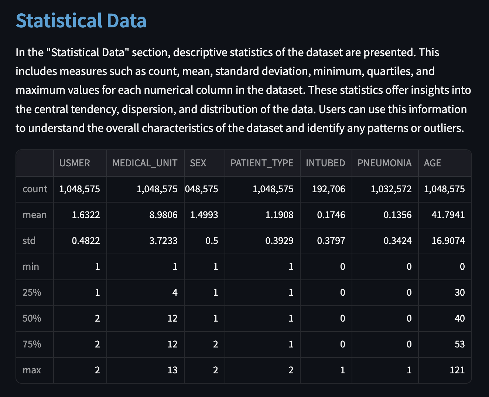

    - **Statistical Data** In this product, descriptive statistical information about the dataset is provided. For each numerical column in the dataset, measurements such as count, mean, standard deviation, minimum, quartiles, and maximum are available. These statistics offer insights into the tendency and distribution of the dataset.

    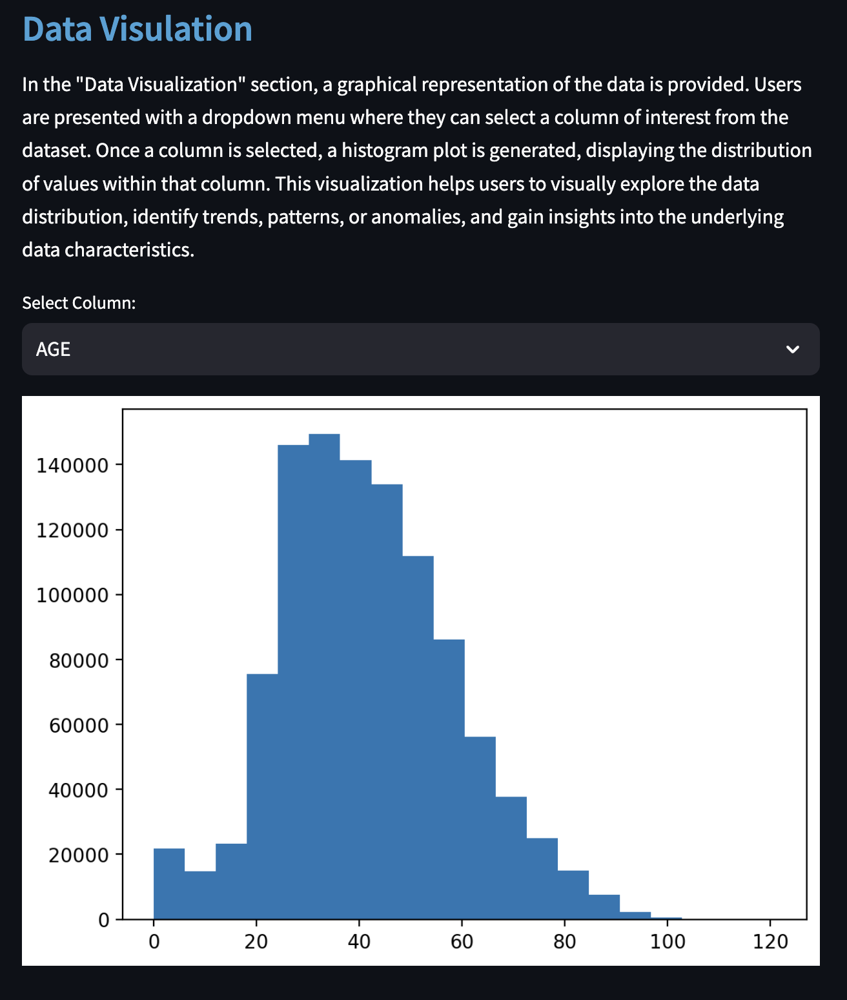

    - **Data Visulation** In this section, graphical representation of the data is provided. After users select the column of interest from the dataset, a graph illustrating the distribution of values in that column is generated. This enables users to examine the data from a different perspective with ease.

4. Check Yourself

        | Prediction 1                    | Prediction 2                    |
        |---------------------------------|---------------------------------|
        |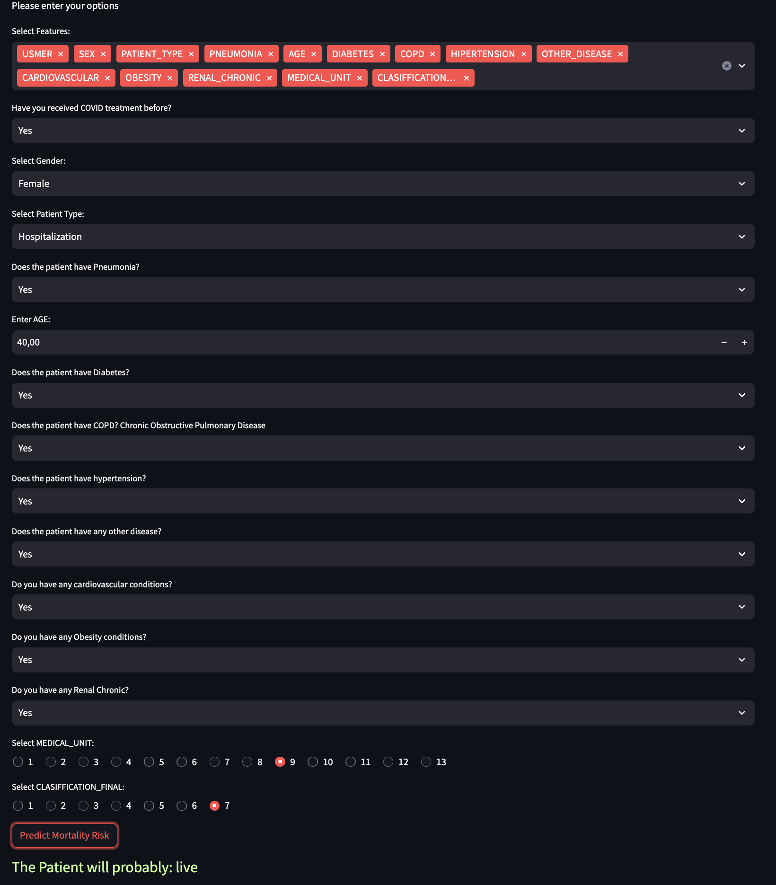|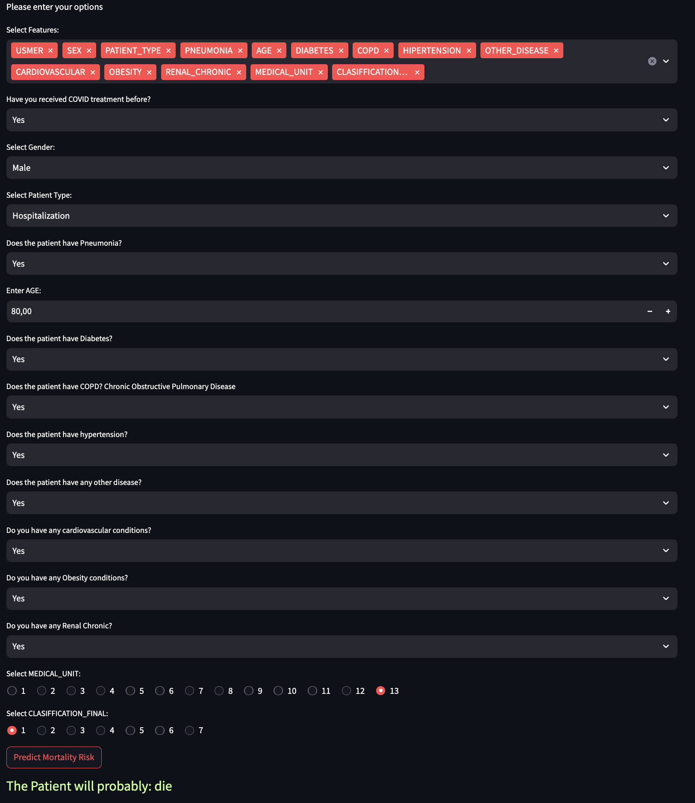|

    In this section, when certain information is provided to you, a prediction is made about whether the individual's vital functions will continue. However, it should be noted that this prediction may not accurately reflect reality.

5. Test Result

    - **Correlation Test** The correlation test is a statistical technique used to assess the strength and direction of the relationship between two variables. This test attempts to determine how strong the relationship between variables is and in which direction it exists.

        In my project, I have included a table that clearly displays the connections between relevant features and their relationships.

    - **Training Accuary** A performance metric that expresses the success of an ML model on the training set. In my project, this score is displayed as 0.9626941603535738.

    - **Testing Accuracy** A performance metric that expresses the success of an ML model on the test data. In my project, this score is displayed as 0.9328095221847994.

    - **F1 Score** F1 Score is a metric used in binary classification tasks, which combines both precision and recall into a single measure. For my project, this score is: 0.48611369990680336.

    - **Confusion Matrix** Confusion Matrix, is a metric used to evaluate the performance of a classification model. 

    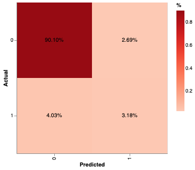

    - **Decision Tree ROC Curve** It is a graphical representation of the performance of a binary classification model, such as a decision tree classifier, at different threshold values.

    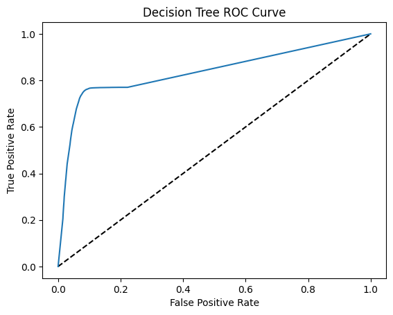

[Back to Top](#table-of-contents)


## Feature Developments

After consolidating the input data and outcomes and reporting them to the relevant units, generating order information for pharmaceuticals or necessary medical supplies from manufacturers, along with logistic forecasts, and providing information on the dates when end-users can access them.

[Back to Top](#table-of-contents)

## Testing

| Feature | Expected Outcome | Testing Performed | Result | Pass/Fail |
|---------|------------------|-------------------|--------|-----------|
| Nav Links | Nav links should load the corresponding page | Click the nav links| All links open the appropriate pages	| Pass |
| Links | Links should load the appropriate content	| Click the kaggle link	| Link loads the kaggle Covid data page | Pass |
| Dataset Size | The representation of the data indicating the size of the dataset was provided accurately and comprehensively. | Wait to proccess | The value was written/displayed on the screen. | Pass |
| Data Summary | Printing the data to the screen. | Click the Data Features link | Wait to proccess | Pass |
| Access Data | The user first selects the amount of data and then selects the columns to be listed. | Select record count after then select column(s). | Displaying the relevant columns in the specified amount. | Pass |
| Statistical Data | Showing statistical data | Wait to proccess | The value was written/displayed on the screen. | Pass |
| Data Visulation | Showing data as graphical view | The user selects the column to be displayed graphically. | Wait to proccess | Pass |
| Check Yourself | After the user enters the data, life expectancy prediction is made. | Entering individual's health information. | The prediction has been printed/displayed on the screen. | Pass |

[Back to Top](#table-of-contents)

## Data Analysis and Machine Learning Libraries

altair==5.3.0
Altair is a library used for data visualization in Python. It is particularly used to create interactive and explanatory graphics.

blinker==1.7.0
Blinker is a library used in Python for event-driven programming.

cachetools==5.3.3
A library for facilitating caching.

click==8.1.7
A library for creating and managing console applications.

contourpy==1.2.1
A library for creating 2D and 3D contour plots.

cycler==0.12.1
A library for generating color cycles.

fonttools==4.51.0
Tools for reading and writing font files.

gitdb==4.0.11
GitPython==3.1.43
Libraries for accessing and manipulating Git databases.

joblib==1.4.0
Tools for parallel processing and memory management.

kaggle==1.6.12
A library for interacting with the Kaggle API.

kiwisolver==1.4.5
Tools for mathematical solvers.

matplotlib==3.8.4
A library for creating graphics.

numpy==1.26.4
A library for scientific computation and data manipulation.

pandas==2.2.2
A library for data analysis and manipulation.

pillow==10.3.0
A library for image processing.

protobuf==4.25
Tools for defining and using protocol data units.

pyarrow==15.0.2
Tools for using the Apache Arrow data format.

pydeck==0.8.1b0
A library for interactive data visualization.

pyparsing==3.1.2
Tools for parsing and analyzing text.

python-slugify==8.0.4
A library for converting strings to URL-friendly slugs.

pytz==2024.1
Tools for handling timezone information.

scikit-learn==1.4.2
A library containing machine learning algorithms.

scipy==1.13.0
A library for scientific and engineering calculations.

seaborn==0.13.2
A library providing a high-level interface for data visualization.

smmap==5.0.1
Tools for handling large data files.

streamlit==1.33.0
A library for creating and sharing web applications.

tenacity==8.2.3
Tools for implementing retry strategies.

text-unidecode==1.3
Tools for converting Unicode characters to ASCII.

threadpoolctl==3.4.0
Tools for controlling parallel processing queues.

toml==0.10.2
Tools for reading and writing configuration files in TOML format.

toolz==0.12.1
Tools for data processing and functional programming.

tqdm==4.66.2
A library for creating progress bars.

tzdata==2024.1
It contains timezone information and is used to manage timezone and daylight saving time changes in different geographical regions.

watchdog==4.0.0
Tools for monitoring and processing filesystem events.

[Back to Top](#table-of-contents)

## Deployment

This application has been deployed from GitHub to Heroku by following the steps:

1. Create a requirement.txt file in GitHub, for Heroku to read, listing the dependencies the program needs in order to run.
    
2. Set the runtime.txt Python version to a version that the current Heroku stack supports.
    
3. Push the recent changes to GitHub and go to your Heroku account page to create and deploy.
    
4. Chose "CREATE NEW APP", give it a unique name, and select a geographical region.
    
5. From the Deploy tab, chose GitHub as deployment method, connect to GitHub and search for and select the project's repository.
    
6. Select the branch you want to deploy, then click Deploy Branch.
    
7. Click to "Enable Automatic Deploys " or chose to "Deploy Branch" from the Manual Deploy section.
    
8. Wait for the logs to run while the dependencies are installed and the app is being built.
    
9. The mock terminal is then ready and accessible from a link similar to https://your-projects-name.herokuapp.com/
    
10. If the slug size is too large then add large files not required for the app to the .slugignore file, similar to the .gitignore file.

[Back to Top](#table-of-contents)

## Credits

Dataset: From user <a href="https://www.kaggle.com/datasets/meirnizri/covid19-dataset" target="_blank">MEIR NIZRI</a>

Readme: I utilized the following two repositories for preparing the readme file.

[KieMerr17](https://github.com/KieMerr17/PP5-Driver-Awareness-Detector?tab=readme-ov-file#dashboard-design)

[vivhubb](https://github.com/vivhubb/portfolio-project-5-price-predictor?tab=readme-ov-file#the-rationale-to-map-the-business-requirements-to-the-data-visualizations-and-ml-tasks)

[jflets](https://github.com/jflets/ml-mildew-detector?tab=readme-ov-file#implementation-of-crisp-dm)

[Back to Top](#table-of-contents)

## Acknowledgements

I extend my thanks to my mentor, Mr. Rohit, for his assistance.

[Back to Top](#table-of-contents)